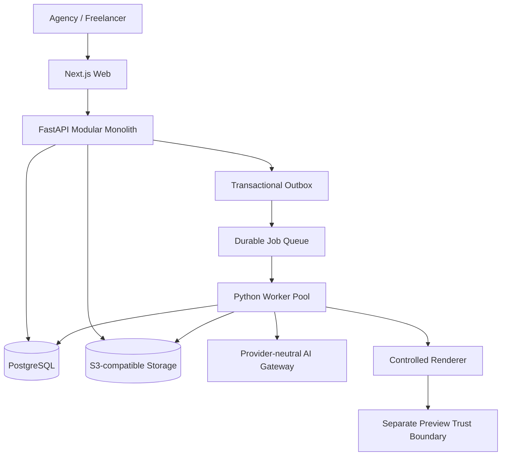

# معماری سیستم Aria AI — v2.0

- وضعیت منبع: FINAL / Approved for Sprint 1
- منبع حاکم: [Aria AI — Final System Architecture v2.0](https://docs.google.com/document/d/1X1GXQniuZ1RANrnlV1eRAyV8DJ1nQh9e4xaFbT96SSM/edit)
- تاریخ همگام‌سازی: 2026-08-17

## تصمیم پایه

سبک معماری `Modular Monolith + Durable Async Worker Pool` است. سه deployable پایه `web`، `api` و `worker` هستند. Domain جدید تا زمانی که evidence قابل اندازه‌گیری برای Scale، Isolation، Ownership یا Release مستقل وجود نداشته باشد به Microservice تبدیل نمی‌شود.

Stack مصوب:

- Web: Next.js + React + TypeScript Strict
- API: Python 3.12+ + FastAPI/Pydantic
- Persistence: PostgreSQL به‌عنوان Transactional Source of Truth
- Object IO: S3-compatible private storage port
- Async: Durable Queue با at-least-once delivery و idempotent consumer
- Cache/Quota projection: Redis-compatible؛ نه Domain یا Financial Source of Truth

## توپولوژی



## لایه‌ها و جهت وابستگی

```text
API / Presentation → Application Use Cases → Domain
Infrastructure Adapters ─implements→ Domain/Application Ports
```

- Router فقط transport validation، identity/tenant resolution، use-case invocation و error mapping انجام می‌دهد.
- Application transaction، authorization، repository coordination، domain policy و outbox scheduling را کنترل می‌کند.
- Domain فقط Entity، Value Object، Invariant، Policy و Port دارد و FastAPI، Pydantic، SQLAlchemy، Redis، Supabase و AI SDK را import نمی‌کند.
- Provider SDK فقط در Infrastructure Adapter مجاز است.
- مطابق ADR-055، دو Adapter زیرساختی فقط برای Evaluation مصنوعی تعریف شده‌اند؛ هیچ Primary/Fallback
  runtime وجود ندارد، Price پیش از paid call resolve می‌شود و accounting پشتیبانی‌نشده fail-closed
  است.

## Domain Boundaries

| Module | مسئولیت |
|---|---|
| Identity & Membership | identity projection، account، membership، tenant context |
| Projects | project lifecycle و project type |
| Context | source، source version، structured item و context version |
| Requirements | requirement lifecycle و source trace |
| Gaps & Clarifications | gap، question، answer و resolution |
| Scope | draft، readiness policy و immutable version snapshot |
| Jobs | durable job lifecycle و idempotency |
| Metering | provider price version و append-only usage ledger |
| Sharing & Approval | Sprint 2 |
| Artifact & Revision | Sprint 3/4 |
| Billing & Entitlement | Sprint 5 |

Cross-module write فقط از Application Service انجام می‌شود. Side effect async حیاتی از Transactional Outbox عبور می‌کند.

## Multi-Tenant Invariants

- Tenant Anchor برابر `account_id` است.
- Aggregateهای محتوایی `account_id` مستقیم دارند.
- Client-supplied `account_id` authority نیست.
- Authorization در Backend، tenant-scoped repository، RLS و Cross-Tenant Test به‌صورت defense-in-depth استفاده می‌شوند.
- Service Role فقط در adapter محدود و audit‌شده مجاز است.

## Async Contract

```text
queued → running → succeeded | failed | cancelled
```

Critical parsing، AI، validation، generation، revision و export فقط در Worker اجرا می‌شوند. Job Status API منبع حقیقت Client است؛ SSE صرفاً enhancement است و Polling fallback الزامی می‌ماند. Delivery حداقل یک‌بار فرض می‌شود و duplicate نباید Artifact، Approval، Usage یا State تکراری ایجاد کند.

منطق Application مشترک بین API و Worker در `packages/backend-application` نگهداری می‌شود. Worker
فقط wrapper/runtime است و Domain یا قواعد Context را دوباره تعریف نمی‌کند. مطابق ADR-026، H02
Source snapshot را یک‌بار resolve می‌کند، تمام Candidateها را پیش از Write اعتبارسنجی می‌کند و
Batch معتبر را همراه با پیشروی اتمیک Context Version در یک Transaction ثبت می‌کند.
مطابق ADR-027، H03 فقط defectهای deterministic خروجی مدل را با Policy صریح و حداکثر یک Repair از
همان AI Execution/Routing boundary اصلاح می‌کند؛ Repair و Provider retry شماره و metering مستقل
دارند و هیچ مسیر Repair نمی‌تواند Validation کامل H02 را دور بزند.
مطابق ADR-030، Requirement Domain نسخهٔ عددی Context و provenance آمادهٔ همان Tenant را حفظ می‌کند؛
پایداری تک Requirement از Application Port عبور می‌کند و I01 هیچ API، Generation یا merge policy
معرفی نمی‌کند.
مطابق ADR-031، I02 در Worker و از Application مشترک، Snapshot دقیق Context را با بردار
`(context_item_id, updated_at)` قفل می‌کند، خروجی provider-neutral را validate/repair می‌کند و
Requirementها و signal تعارض Outbox را اتمیک می‌نویسد. Replay با `generation_job_id` از AI و Usage
تکراری جلوگیری می‌کند، اما فقط پس از resolve شدن Job همان Tenant با status نهایی
`succeeded|failed`. Snapshot تاریخی payload و جدول result مستقل در I02 وجود ندارد؛ Provider واقعی،
Queue wiring، Gap و API همچنان خارج این Story هستند.
مطابق ADR-032، I03 یک Router نازک روی Application Service و Repository tenant-scoped اضافه می‌کند؛
manual create از Idempotency store موجود استفاده می‌کند، PATCH با CAS انجام می‌شود و DELETE فقط
soft deactivation است. API به metadata داخلی Generation یا دادهٔ Tenant authority دسترسی نمی‌دهد.

مطابق ADR-046، Product Analytics یک envelope نسخه‌دار و provider-neutral دارد؛ outcomeهای سروری
پس از commit کسب‌وکار و interactionهای کاربر با نام‌های جداگانه ثبت می‌شوند. شناسهٔ پایدار event
کلید idempotency ingestion است و متن/محتوای دامنه، provenance، prompt و پاسخ Provider هرگز در
event یا log قرار نمی‌گیرد. این baseline هیچ Provider، جدول یا deployable جدیدی اضافه نمی‌کند.

مطابق ADR-047، Operational Metrics در Staging از adapter زیرساختی OpenTelemetry و OTLP/HTTP مستقیم
به Grafana Cloud ارسال می‌شود؛ این مسیر fail-open، bounded و staging-only است و topology مبتنی بر
Collector/Alloy برای Production تصمیمی Deferred باقی می‌ماند. PostgreSQL منبع حقیقت Queue/Outbox
است و `aria_observer` فقط Viewهای صریح schema خصوصی `observability` را می‌خواند؛ Metricها هرگز
شناسه Tenant/Resource یا محتوای مشتری را label نمی‌کنند و cost-by-project فقط query-driven است.

مطابق ADR-048، Tenant Isolation با Fixtureهای هم‌زمان Tenant A/B در سه مرز HTTP، Repository و
Database/RLS اثبات می‌شود. Resource ناموجود و foreign یک پاسخ یکسان `RESOURCE_NOT_FOUND` دارند و
audit عمومی `resource.access_denied` فقط از context مجاز همان request ساخته می‌شود؛ هیچ lookup
خارج از Tenant برای تشخیص existence انجام نمی‌شود. Scope عمومی با `project_id + version_no` و UUID
داخلی Scope فقط در Repository/Database/RLS آزموده می‌شود.

## AI و Generation Guardrails

- تمام Taskها از Provider-neutral Gateway عبور می‌کنند.
- Raw model output مستقیم persist نمی‌شود: schema validation → business validation → provenance/unsupported check → bounded repair → explicit failure.
- Generation از Schema-first Controlled Renderer استفاده می‌کند.
- Arbitrary server code، shell execution، secret injection و نصب آزاد npm dependency ممنوع است.
- Preview روی registrable domain جدا و بدون Core Cookie/Secret اجرا می‌شود.

## Versioning و Source of Truth

- PostgreSQL منبع حقیقت Domain، Job، Outbox و Usage Ledger است.
- Raw Source حفظ می‌شود؛ AI summary منبع حقیقت نیست.
- ScopeVersion و ArtifactVersion Snapshot تغییرناپذیرند.
- Restore تاریخچه را حذف نمی‌کند.
- Redis فقط queue/cache/quota projection است.

## مسیر Scale

API و Worker جداگانه scale افقی می‌شوند. AI Worker، Preview Runtime یا Billing/Metering فقط با evidence واقعی و ADR جدید قابل استخراج‌اند. Kubernetes، Kafka، Service Mesh، Event Sourcing کامل و Microservice-per-domain خارج از MVP baseline هستند.

