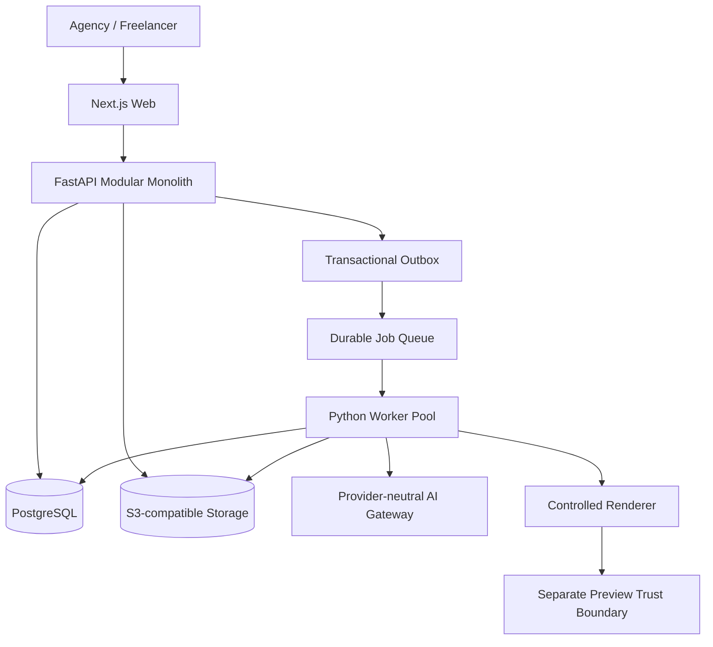

# معماری سیستم Aria AI — v2.0

- وضعیت منبع: FINAL / Approved for Sprint 1
- منبع حاکم: [Aria AI — Final System Architecture v2.0](https://docs.google.com/document/d/1X1GXQniuZ1RANrnlV1eRAyV8DJ1nQh9e4xaFbT96SSM/edit)
- تاریخ همگام‌سازی: 2026-08-17

## تصمیم پایه

سبک معماری `Modular Monolith + Durable Async Worker Pool` است. سه deployable پایه `web`، `api` و `worker` هستند. Domain جدید تا زمانی که evidence قابل اندازه‌گیری برای Scale، Isolation، Ownership یا Release مستقل وجود نداشته باشد به Microservice تبدیل نمی‌شود.

Stack مصوب:

- Web: Next.js + React + TypeScript Strict
- API: Python 3.12+ + FastAPI/Pydantic
- Persistence: PostgreSQL به‌عنوان Transactional Source of Truth
- Object IO: S3-compatible private storage port
- Async: Durable Queue با at-least-once delivery و idempotent consumer
- Cache/Quota projection: Redis-compatible؛ نه Domain یا Financial Source of Truth

## توپولوژی


```mermaid
flowchart TD
    U["Agency / Freelancer"] --> W["Next.js Web"]
    W --> A["FastAPI Modular Monolith"]
    A --> P[("PostgreSQL")]
    A --> O["Transactional Outbox"]
    A --> S[("S3-compatible Storage")]
    O --> Q["Durable Job Queue"]
    Q --> K["Python Worker Pool"]
    K --> G["Provider-neutral AI Gateway"]
    K --> P
    K --> S
    K --> R["Controlled Renderer"]
    R --> X["Separate Preview Trust Boundary"]
```

## لایه‌ها و جهت وابستگی

```text
API / Presentation → Application Use Cases → Domain
Infrastructure Adapters ─implements→ Domain/Application Ports
```

- Router فقط transport validation، identity/tenant resolution، use-case invocation و error mapping انجام می‌دهد.
- Application transaction، authorization، repository coordination، domain policy و outbox scheduling را کنترل می‌کند.
- Domain فقط Entity، Value Object، Invariant، Policy و Port دارد و FastAPI، Pydantic، SQLAlchemy، Redis، Supabase و AI SDK را import نمی‌کند.
- Provider SDK فقط در Infrastructure Adapter مجاز است.
- مطابق ADR-055، دو Adapter زیرساختی فقط برای Evaluation مصنوعی تعریف شده‌اند؛ هیچ Primary/Fallback
  runtime وجود ندارد، Price پیش از paid call resolve می‌شود و accounting پشتیبانی‌نشده fail-closed
  است.

## Domain Boundaries

| Module | مسئولیت |
|---|---|
| Identity & Membership | identity projection، account، membership، tenant context |
| Projects | project lifecycle و project type |
| Context | source، source version، structured item و context version |
| Requirements | requirement lifecycle و source trace |
| Gaps & Clarifications | gap، question، answer و resolution |
| Scope | draft، readiness policy و immutable version snapshot |
| Jobs | durable job lifecycle و idempotency |
| Metering | provider price version و append-only usage ledger |
| Sharing & Approval | Share-Link امن، resolve عمومی ScopeVersion دقیق، و Approval آینده |
| Artifact & Revision | Sprint 3/4 |
| Billing & Entitlement | Sprint 5 |

Cross-module write فقط از Application Service انجام می‌شود. Side effect async حیاتی از Transactional Outbox عبور می‌کند.

## Multi-Tenant Invariants

- Tenant Anchor برابر `account_id` است.
- Aggregateهای محتوایی `account_id` مستقیم دارند.
- Client-supplied `account_id` authority نیست.
- Authorization در Backend، tenant-scoped repository، RLS و Cross-Tenant Test به‌صورت defense-in-depth استفاده می‌شوند.
- Service Role فقط در adapter محدود و audit‌شده مجاز است.

## Async Contract

```text
queued → running → succeeded | failed | cancelled
```

Critical parsing، AI، validation، generation، revision و export فقط در Worker اجرا می‌شوند. Job Status API منبع حقیقت Client است؛ SSE صرفاً enhancement است و Polling fallback الزامی می‌ماند. Delivery حداقل یک‌بار فرض می‌شود و duplicate نباید Artifact، Approval، Usage یا State تکراری ایجاد کند. مطابق ADR-057، Outbox Relay فقط channel صریح `job_queue` را با claim کوتاه `FOR UPDATE SKIP LOCKED` و lease پایدار تحویل می‌دهد؛ `domain_event` delivery و Hosted activation همچنان Deferred هستند.

مطابق ADR-058، AI-01 در 0071 فقط یک Runtime Foundation مصنوعی و explicit است. Scheduler داخلی
Job/Outbox را idempotent می‌سازد، Queue فقط شناسه‌های نسخه‌دار را حمل می‌کند و Worker تمام Context
را از PostgreSQL resolve می‌کند. درج Context Itemها، افزایش `current_context_version` و موفقیت Job
یک Transaction واحد هستند. Public Endpoint، Parser chaining، Hosted task registration، Provider
واقعی، Customer Content و post-provider paid recovery در این Increment فعال نیستند.

مطابق ADR-069، 0083 مرز provider-neutral بازیابی پس از پاسخ AI را به‌صورت Synthetic Foundation
اضافه می‌کند. Attempt پیش از فراخوانی پایدار می‌شود؛ normalized result معتبر و Usage همان Attempt
اتمیک checkpoint می‌شوند و recovery فقط همان نتیجه را برای Domain finalization بازاستفاده می‌کند.
Attempt شروع‌شده بدون checkpoint با `AI_INVOCATION_OUTCOME_UNKNOWN` و بدون فراخوانی خودکار مجدد
fail-closed می‌شود. payload موقت فقط پس از موفقیت Job پاک می‌شود. این Port/Adapter در Hosted
Composition Root فعال نیست و Provider واقعی و Customer Content همچنان NO-GO هستند.

مطابق ADR-070، 0084 این مرز را فقط به AI-01 مصنوعی و تک-attempt متصل می‌کند. Attempt ID پیش از
Fake invocation ساخته می‌شود، Source Versionهای دقیق fingerprint می‌شوند و `result_ready` بدون
فراخوانی یا Usage تازه بازیابی می‌گردد. Context Items، Project Context Version، موفقیت Job و
پاک‌سازی checkpoint اتمیک‌اند. Hosted و multi-attempt composition همچنان فعال نیستند.

مطابق ADR-071، 0085 یک حالت opt-in و صرفاً مصنوعی برای Technical Retry شناخته‌شده اضافه می‌کند.
Timeout تلاش اول به‌صورت `failed_known` همراه Usage ناموجود و `retry_not_before` پایدار ثبت می‌شود؛
پس از restart همان schedule و fingerprint استفاده شده و فقط یک Attempt دوم مجاز است. Ambiguous
`started` همچنان terminal است و Repair، Fallback، Provider واقعی و Hosted activation فعال نیستند.

منطق Application مشترک بین API و Worker در `packages/backend-application` نگهداری می‌شود. Worker
فقط wrapper/runtime است و Domain یا قواعد Context را دوباره تعریف نمی‌کند. مطابق ADR-026، H02
Source snapshot را یک‌بار resolve می‌کند، تمام Candidateها را پیش از Write اعتبارسنجی می‌کند و
Batch معتبر را همراه با پیشروی اتمیک Context Version در یک Transaction ثبت می‌کند.
مطابق ADR-027، H03 فقط defectهای deterministic خروجی مدل را با Policy صریح و حداکثر یک Repair از
همان AI Execution/Routing boundary اصلاح می‌کند؛ Repair و Provider retry شماره و metering مستقل
دارند و هیچ مسیر Repair نمی‌تواند Validation کامل H02 را دور بزند.
مطابق ADR-056، Technical Retry در Application به اجرای اولیه و حداکثر یک Retry محدود است؛
Fallback تنها پس از exhaustion و با مجوز مستقل Quality/Budget یک بار اجرا می‌شود. هر invocation
شناسهٔ حسابداری یکتا دارد و زنجیرهٔ کامل حداکثر سه فراخوانی Provider می‌سازد؛ هیچ Provider واقعی
به‌عنوان Primary/Fallback در Composition Root فعال نشده است.
مطابق ADR-030، Requirement Domain نسخهٔ عددی Context و provenance آمادهٔ همان Tenant را حفظ می‌کند؛
پایداری تک Requirement از Application Port عبور می‌کند و I01 هیچ API، Generation یا merge policy
معرفی نمی‌کند.
مطابق ADR-031، I02 در Worker و از Application مشترک، Snapshot دقیق Context را با بردار
`(context_item_id, updated_at)` قفل می‌کند، خروجی provider-neutral را validate/repair می‌کند و
Requirementها و signal تعارض Outbox را اتمیک می‌نویسد. Replay با `generation_job_id` از AI و Usage
تکراری جلوگیری می‌کند، اما فقط پس از resolve شدن Job همان Tenant با status نهایی
`succeeded|failed`. Snapshot تاریخی payload و جدول result مستقل در I02 وجود ندارد؛ Provider واقعی،
Queue wiring، Gap و API همچنان خارج این Story هستند.
مطابق ADR-032، I03 یک Router نازک روی Application Service و Repository tenant-scoped اضافه می‌کند؛
manual create از Idempotency store موجود استفاده می‌کند، PATCH با CAS انجام می‌شود و DELETE فقط
soft deactivation است. API به metadata داخلی Generation یا دادهٔ Tenant authority دسترسی نمی‌دهد.

مطابق ADR-046، Product Analytics یک envelope نسخه‌دار و provider-neutral دارد؛ outcomeهای سروری
پس از commit کسب‌وکار و interactionهای کاربر با نام‌های جداگانه ثبت می‌شوند. شناسهٔ پایدار event
کلید idempotency ingestion است و متن/محتوای دامنه، provenance، prompt و پاسخ Provider هرگز در
event یا log قرار نمی‌گیرد. این baseline هیچ Provider، جدول یا deployable جدیدی اضافه نمی‌کند.

مطابق ADR-047، Operational Metrics در Staging از adapter زیرساختی OpenTelemetry و OTLP/HTTP مستقیم
به Grafana Cloud ارسال می‌شود؛ این مسیر fail-open، bounded و staging-only است و topology مبتنی بر
Collector/Alloy برای Production تصمیمی Deferred باقی می‌ماند. PostgreSQL منبع حقیقت Queue/Outbox
است و `aria_observer` فقط Viewهای صریح schema خصوصی `observability` را می‌خواند؛ Metricها هرگز
شناسه Tenant/Resource یا محتوای مشتری را label نمی‌کنند و cost-by-project فقط query-driven است.

مطابق ADR-048، Tenant Isolation با Fixtureهای هم‌زمان Tenant A/B در سه مرز HTTP، Repository و
Database/RLS اثبات می‌شود. Resource ناموجود و foreign یک پاسخ یکسان `RESOURCE_NOT_FOUND` دارند و
audit عمومی `resource.access_denied` فقط از context مجاز همان request ساخته می‌شود؛ هیچ lookup
خارج از Tenant برای تشخیص existence انجام نمی‌شود. Scope عمومی با `project_id + version_no` و UUID
داخلی Scope فقط در Repository/Database/RLS آزموده می‌شود.

مطابق ADR-074 و ADR-075، Sharing یک Share Link را فقط به یک ScopeVersion immutable متصل می‌کند و
فقط SHA-256 توکن تصادفی را پایدار نگه می‌دارد. Resolve عمومی صرفاً با `POST` و token داخل body، بدون
JWT یا Tenant header انجام می‌شود؛ expiry/revocation هم‌زمان بررسی می‌شوند و پاسخ مستقل فقط
`version_no`، وضعیت تصمیم همان Version و snapshot allowlisted را با `Cache-Control: no-store`
برمی‌گرداند. نقش‌های Data API
هیچ دسترسی مستقیم به Share Link یا ScopeVersion ندارند و token، hash و محتوای request در telemetry
ثبت نمی‌شوند.

مطابق ADR-076، Create/Revoke لینک اشتراک از API احراز‌شده و Tenant-scoped عبور می‌کند. Create
دارای idempotency اتمیک و one-time token disclosure است: replay فقط شناسه و metadata امن را
برمی‌گرداند و raw token را بازسازی نمی‌کند. Idempotency store فقط `scope_share_link_id` و outcome
امن را نگه می‌دارد؛ Revoke نیز terminal و با body کاملاً خالی idempotent است. Guest Session
همچنان خارج از این مرز است.

مطابق ADR-077، Approval عمومی از `POST` body-token و Idempotency-Key مستقل مهمان استفاده می‌کند.
یک transaction کوتاه Share Link معتبر و ScopeVersion دقیق را lock می‌کند، version/hash همان
snapshot را در Approval immutable ثبت می‌کند و فقط ScopeVersion را به approved می‌برد. replay همان
business result را برمی‌گرداند؛ raw token، version hash و guest attribution وارد response یا
telemetry نمی‌شوند و Project/ShareLink lifecycle تغییر نمی‌کند.

مطابق ADR-078، درخواست تغییر عمومی یک aggregate مستقل و immutable است و مدل ترکیبی Approval
را supersede می‌کند. `POST` body-token با guest idempotency مستقل، comment نرمال‌شده و snapshot
identity دقیق ثبت می‌شود؛ سپس همان ScopeVersion در transaction مشترک به `changes_requested`
می‌رود. Approval و Change Request همان ScopeVersion را lock می‌کنند تا دقیقاً یکی از دو transition
terminal commit شود. هیچ ScopeVersion/Draft جدیدی ساخته نمی‌شود و Project/ShareLink تغییر نمی‌کنند.

مطابق ADR-079، Revision authenticated از مسیر public جدا است: کاربر ابتدا Draft را از K04 ویرایش
می‌کند، سپس command صریح یک Change Request را مصرف کرده و N+1 را با lineage دقیق می‌سازد. ایجاد N+1
و `N → superseded` یک transaction است. comment به Draft یا snapshot merge نمی‌شود و generic K05 در
حضور latest Version با وضعیت `changes_requested` با `SCOPE_REVISION_REQUIRED` متوقف می‌شود.

مطابق ADR-080، API احراز‌شده projectionهای allowlisted ShareLink و تصمیم نهایی را برای یک
ScopeVersion دقیق فراهم می‌کند؛ Member فقط لینک‌های ساخته‌شده توسط خودش را می‌بیند و comment
Change Request فقط در پاسخ tenant-authorized مجاز است، نه telemetry. ورودی مرور عمومی از
`/scope-review#token=...` استفاده می‌کند؛ bootstrap پیش از هر telemetry fragment را با
`history.replaceState` حذف می‌کند، token را فقط در حافظه volatile نگه می‌دارد و سپس resolve body
را فراخوانی می‌کند. refresh عمداً capability را از دست می‌دهد و SCR-14..17 UI به 0094 موکول است.

## AI و Generation Guardrails

- تمام Taskها از Provider-neutral Gateway عبور می‌کنند.
- Raw model output مستقیم persist نمی‌شود: schema validation → business validation → provenance/unsupported check → bounded repair → explicit failure.
- Generation از Schema-first Controlled Renderer استفاده می‌کند.
- مطابق ADR-082، Provider فقط `generation_ast_candidate_v1` بدون شناسه یا state تولید می‌کند.
  Application خروجی را با `component_registry_v1` و قواعد layout/responsive/path/Requirement
  اعتبارسنجی می‌کند، Assetهای UUID را از `AssetRegistryPort` محدود به Account/Project مجاز می‌گیرد
  و سپس `page_id`، `section_id` و `protected_state=unprotected` را می‌افزاید. تنها AST معتبر به
  atomic finalizer port می‌رسد؛ Artifact persistence و Renderer runtime هنوز قرارداد جداگانه‌اند.
- چهارده Component رجیستری بسته‌اند. Asset/alt-text به‌صورت جفت و media layoutهای Hero/About با
  Asset اجباری‌اند. `SimpleForm` فقط preview-only است و هیچ network submission ندارد.
- Arbitrary server code، shell execution، secret injection و نصب آزاد npm dependency ممنوع است.
- Preview روی registrable domain جدا و بدون Core Cookie/Secret اجرا می‌شود.

## Versioning و Source of Truth

- PostgreSQL منبع حقیقت Domain، Job، Outbox و Usage Ledger است.
- Raw Source حفظ می‌شود؛ AI summary منبع حقیقت نیست.
- ScopeVersion و ArtifactVersion Snapshot تغییرناپذیرند.
- Restore تاریخچه را حذف نمی‌کند.
- Redis فقط queue/cache/quota projection است.

## مسیر Scale

API و Worker جداگانه scale افقی می‌شوند. AI Worker، Preview Runtime یا Billing/Metering فقط با evidence واقعی و ADR جدید قابل استخراج‌اند. Kubernetes، Kafka، Service Mesh، Event Sourcing کامل و Microservice-per-domain خارج از MVP baseline هستند.

