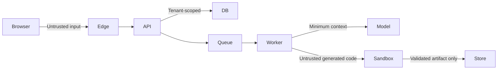

# Threat model — MVP

## دارایی‌های حساس

- بریف، لوگو، تصویر و محتوای مشتری.
- artifact و کد تولیدشده.
- identity، membership و نقش‌ها.
- credit/usage ledger و webhook پرداخت.
- prompt templateها، provider credentialها و signing keyها.

## مرزهای اعتماد

## تهدیدها و کنترل‌ها

| تهدید | نمونه | کنترل پیشگیرانه | تشخیص/بازیابی |
|---|---|---|---|
| Broken tenant isolation | حدس‌زدن project ID tenant دیگر | opaque ID، authz در use case، RLS، signed URL scoped | audit deny، isolation integration test |
| Prompt injection | متن بریف دستور استخراج secret می‌دهد | تفکیک system/data، tool allowlist، context minimization، output schema | policy event، block/quarantine artifact |
| Generated-code escape | script تولیدی به شبکه/فایل میزبان دسترسی می‌گیرد | sandbox بدون network، readonly base، seccomp، quota، timeout | kill، immutable logs، worker rotation |
| Supply-chain injection | dependency دلخواه در export | dependency allowlist/pin، lockfile، SBOM، vulnerability scan | quarantine export، revoke template |
| Stored XSS | preview شامل markup مخرب | AST render، sanitize، CSP، preview origin جدا | CSP report، invalidate artifact |
| SSRF | asset URL داخلی | URL allowlist، DNS/IP validation، fetch proxy بدون private ranges | egress log، request block |
| Credit double-spend | retry هم‌زمان چند رزرو می‌سازد | idempotency، serializable account operation، append-only ledger | reconciliation و alert |
| Webhook spoofing | callback جعلی PSP | signature، timestamp window، replay key | ledger reconciliation |
| Sensitive logs | prompt یا email در trace | structured allowlist logging، redaction | log scan و deletion runbook |
| Artifact tampering | export با preview تأییدنشده عوض می‌شود | SHA-256، immutable object، approval روی hash | verification before download/export |
| DoS/cost abuse | brief بزرگ یا jobهای زیاد | size limit، quota، rate limit، budget reservation | circuit breaker، tenant throttling |

## قواعد model provider

- training opt-out قراردادی و retention کمینه بررسی شود.
- provider credential فقط در worker secret store است.
- raw customer context در log، event یا error ذخیره نمی‌شود.
- model output همیشه untrusted و schema-validated است.
- provider adapter timeout، retry با jitter و circuit breaker دارد.
- برای دادهٔ سازمانی، deployment/provider policy قابل انتخاب است.

## sandbox baseline

- network: deny by default.
- filesystem: ephemeral، non-root، read-only base.
- execution: CPU 1، memory 512MB، wall clock 60s برای validation اولیه.
- process count و output size محدود.
- dependency install در runtime ممنوع؛ فقط registry mirror/allowlist در build service آینده.
- preview از origin جدا با CSP سخت‌گیرانه سرو می‌شود.

## privacy lifecycle

هر project امکان export و delete دارد. delete ابتدا access را revoke، سپس objectها و دادهٔ مشتق‌شده را با job قابل audit پاک می‌کند. backup deletion مطابق retention در privacy policy شفاف می‌شود. محتوای مشتری برای training استفاده نمی‌شود مگر opt-in جداگانه، قابل برگشت و ثبت‌شده.

## موارد باز قبل از production

- انتخاب region و الزامات data residency.
- DPIA/بررسی حقوقی retention و providerها.
- PSP و flow بازگشت وجه.
- penetration test روی tenant isolation، preview origin و sandbox.
- incident response، key rotation و restore drill.

